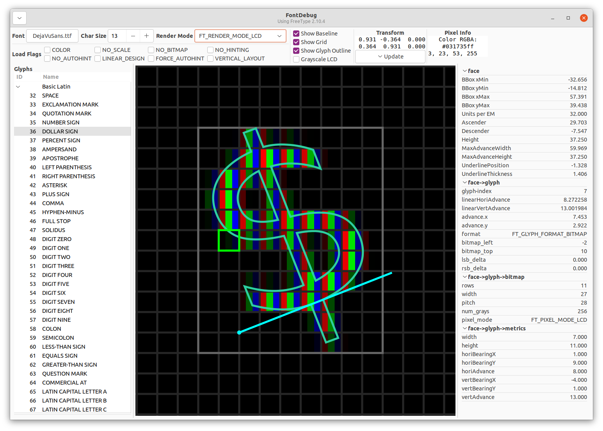

# FontDebug

A utility for exploring FreeType, example screenshot below:



## Building

First `cd` into directory, then:

```
./configure.py
ninja
```

Output will be at `out/fontdebug`.

## Copying

FontDebug is licensed under GNU General Public License Version 3, or any later version. See COPYING file for license text.
